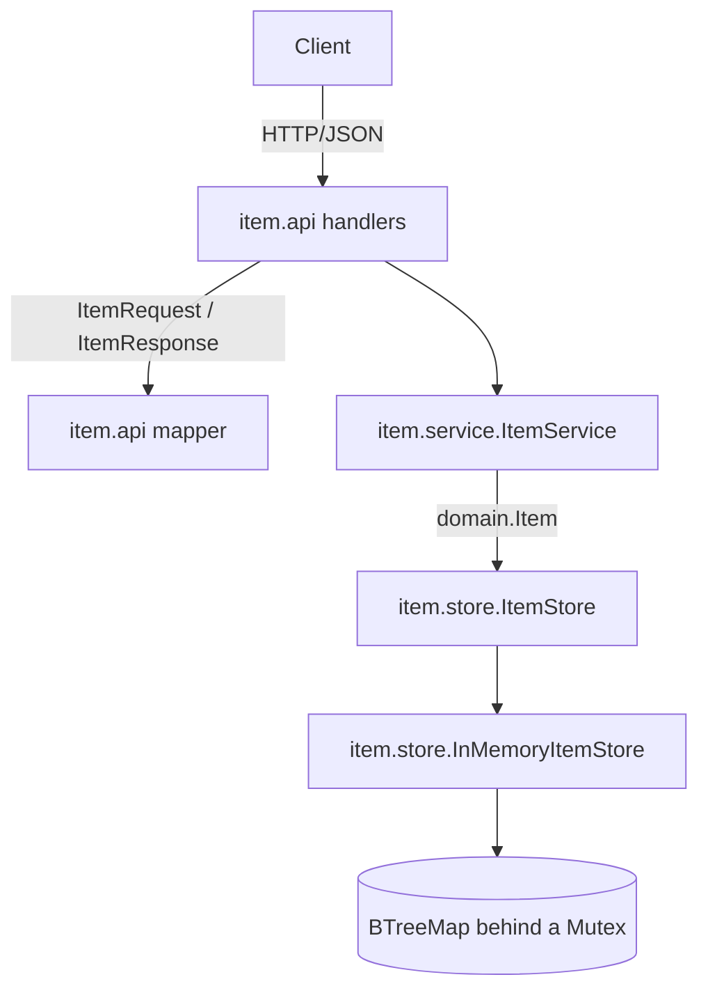

# Architecture

The service is a layered Rust application. A request enters at the axum handler in
`item::api`, which speaks DTOs, and travels down through `item::service`, which speaks the
domain type, to `item::store`, which holds the `ItemStore` port and the in-memory adapter.
Each layer depends only on the layer below it.

## Layers

- `item::api` holds the axum handlers, the transport DTOs, the RFC 7807 problem detail, the mapper between DTOs and the domain, and the `IntoResponse` mapping for `ItemError`. It carries the `utoipa` annotations, so the OpenAPI document is generated from this code.
- `item::service` holds the business logic. It works in `domain::Item` and depends on the `item::store::ItemStore` port, not on the adapter.
- `item::domain` holds `Item`, the type the service reasons about, and `ItemError`. It has no framework imports.
- `item::store` holds the domain-facing port and the in-memory adapter that implements it, along with the three dev seeds.
- `app::build_router` wires the routes to the handlers. `main.rs` builds the store, the service, and the listener. `openapi.rs` derives the OpenAPI document.

## Containment

The controller never sees a store record and the service never sees a DTO. The adapter is the
only place that writes to the `BTreeMap`, and the mapper is the only place that converts between
`Item` and the DTOs. That keeps the framework out of the domain and the business logic.
